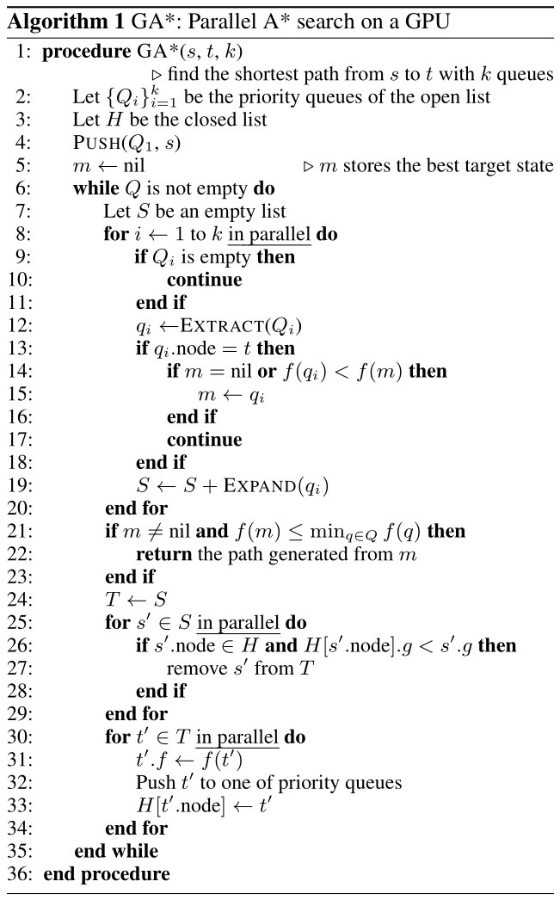
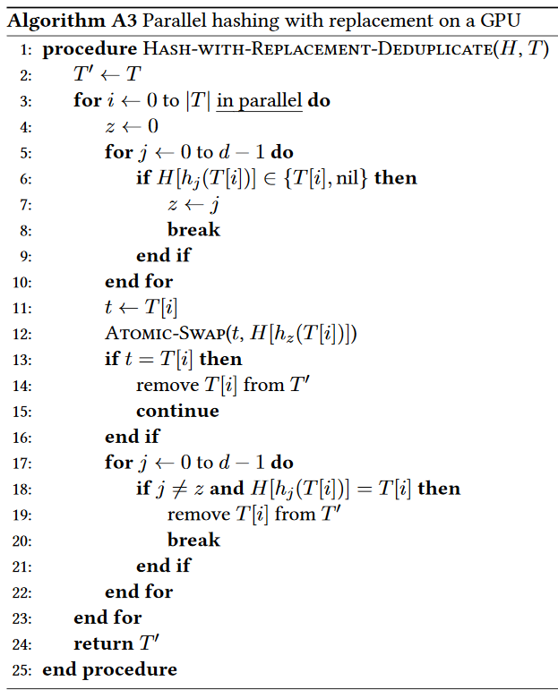
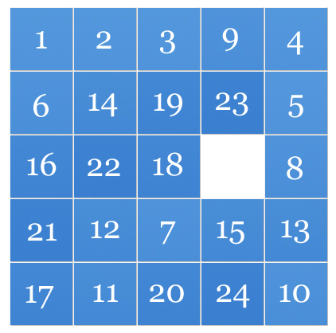
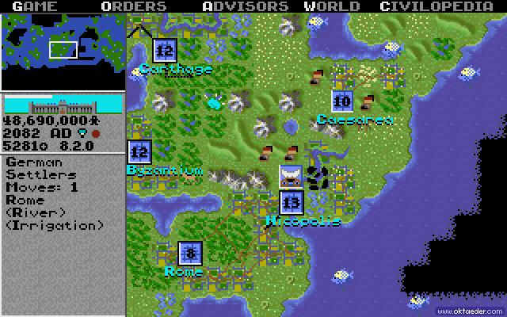
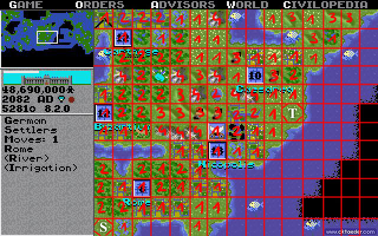

# Massively Parallel A* Search on a GPU

## 1. Introduction

A* (or AStar) is a graph search algorithm widely used in artificial intelligence. While the traditional version of this algorithm is purely sequential, there have been several parallel versions over the years. One such variant is the approach described by Zhou and Zeng in their paper Massively Parallel A* Search on a GPU. It's a version of A* designed for GPU execution.

## 2. Details

The algorithm is described in this paper: Massively Parallel A* Search on a GPU.

The paper describes the search algorithm itself and two node duplication detection schemes: Parallel Cuckoo Hashing and Parallel Hashing with Replacement. Duplication detection is needed so the A* algorithm doesn't expand already visited nodes. In your solutions you need to focus only on Parallel Hashing with Replacement - it's a bit easier to implement. You can find the pseudocode for that duplication detection scheme in the appendix (or below in Figure 2).

Figure 1. Pseudocode for the parallel A* algorithm


Figure 2. Pseudocode for Parallel Hashing with Replacement


The paper presents 3 possible applications of A*: sliding puzzles, pathfinding and protein design. In this assignment we'll focus on the first two.

### a) Sliding puzzles

A sliding puzzle is a task of finding the smallest number of moves from one configuration of cells to another in an NxN grid, where each move slides one cell to an empty space in the grid. Here we'll use N=5.

Figure 3. A 5x5 sliding puzzle


We need to use a heuristic function that approximates a distance to the target configuration. The Zhou paper uses the disjoint pattern database method, but we'll use a simple Manhattan distance instead. Let's look at an example for a 3x3 grid:

```
2 1 3     1 2 3           1 2 3 4 5 6 7 8
5 4 0     4 5 6           ---------------
6 7 8     7 8 0           1+1+0+1+1+3+1+1 = 9
```

For each cell we count the number of moves necessary to get to their target positions (or simply |x1−x2|+|y1−y2|, where xi,yi are cell coordinates) and sum them together. The resulting number is an approximate distance between two configurations.

### b) Pathfinding

In this task we search for a shortest path between two points on a grid. Each cell is connected with up to 8 neighbours and connections are weighted. One example of a task like this is moving a unit in the Civilization video game. The map in that game is comprised of square tiles. Each of them has a specific terrain type which has an effect on movement speed. For instance, moving through mountains is more difficult than over plains, so the movement cost is higher in the former case.

Figure 4. Map view in the original Civilization


Figure 5. Map view with an overlay indicating: start and target positions. movement costs


In this assignment, all weights are 1 unless they're overridden in the input file. Similarly, it's possible to set obstacles in the input file - nodes don't form connections to cells denoted as such. Cell at position (0,0) is in the lower left corner of the grid.

For the heuristic function, we again use the Manhattan distance: |x1−x2|+|y1−y2|.

## Requirements

Write your kernel code in CUDA C. The host code can be either in C or C++. The specifics of the device code are up to you - choose appropriate memory types, synchronisation techniques, use streaming or not, etc. You can optimise for Titan X GPUs on bruce. Use one GPU - you don't have to utilise a multi-GPU setup.

**IMPORTANT**: You can't use third-party libraries in your kernels - all code that's executed on the GPU needs to be implemented by you. You can however use external libraries in your host code to handle I/O tasks, prepare input data, etc.

You can organise your source code in any way you like, but it has to be properly divided into modules. Your Makefile should produce a single executable named astar_gpu.

That executable must handle the following command line arguments:
--version sliding | pathfinding - selects either sliding puzzle or pathfinding
--input-data PATH - file containing graph definition
--output-data PATH - file containing program execution time in milliseconds (excluding I/O operations) and search results

You should describe your solution in a detailed report - focus on explaining your implementation and optimisation techniques. Include screenshots from NVIDIA Visual Profiler that show GPU utilisation during program execution.

### a) Sliding puzzle
```
./astar_gpu --version sliding --input-data /home/user/input.txt --output-data /home/user/result.txt
```

For the sliding puzzle, the input file must have the following format:
```
1,2,_,3,4,5,6,7,8,9,10,11,12,13,14,15,16,17,18,19,20,21,22,23,24
4,9,8,12,14,_,18,13,11,19,21,23,20,24,15,1,3,7,16,5,6,2,10,17,22
```
The first line is the start configuration and the second line is the target configuration.

The output file should look like this:
```
1324
1,2,_,3,4,5,6,7,8,9,10,11,12,13,14,15,16,17,18,19,20,21,22,23,24
1,2,3,_,4,5,6,7,8,9,10,11,12,13,14,15,16,17,18,19,20,21,22,23,24
...
4,9,8,12,14,18,_,13,11,19,21,23,20,24,15,1,3,7,16,5,6,2,10,17,22
4,9,8,12,14,_,18,13,11,19,21,23,20,24,15,1,3,7,16,5,6,2,10,17,22
```
The first line is the execution time in milliseconds. The following lines are the shortest path found by the A* algorithm.
### b) Pathfinding
```
./astar_gpu --version pathfinding --input-data /home/user/input.txt --output-data /home/user/result.txt
```

For pathfinding, the input file must have the following format:
```
10,10
0,0
9,9
2
1,1
2,3
4
2,2,3
4,3,2
1,4,5
3,4,2
```
The first line is the grid size. The second line is the start position, followed by the end position in the third line. The fourth line is the number of obstacle positions, o. Then there are o lines with obstacle coordinates. This is followed by a line containing the number of cells which have connections with weights different than 1, w. Then there are w lines, each storing the cell coordinates and a weight value.

The output file should look like this:
```
2345
0,0
0,1
...
8,9
9,9
```

The first line is the execution time in milliseconds. The following lines are the shortest path found by the A* algorithm.

